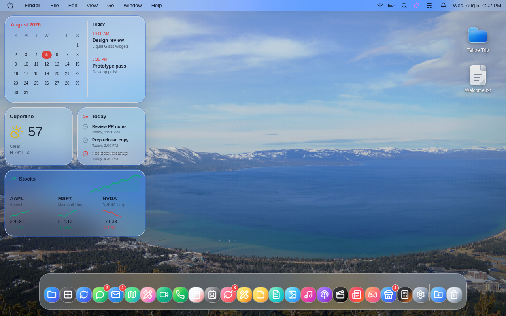
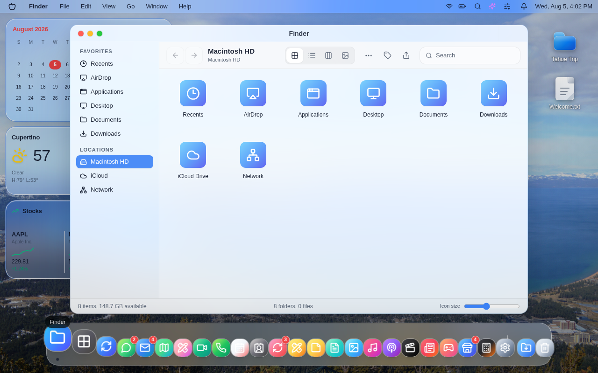
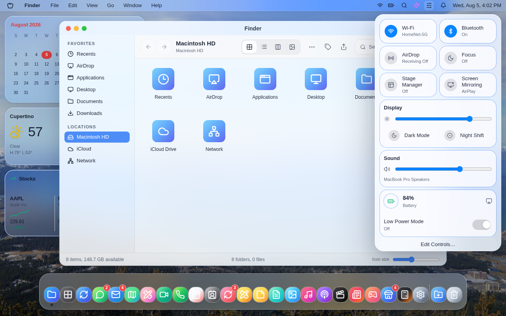

# macOS27 Claude

An open-source macOS 27 web simulator built with React, TypeScript, Tailwind CSS, Vite, and zustand.

[](https://macos27-claude.vercel.app/)


## 🔗 Live Demo: https://macos27-claude.vercel.app/



| Finder | Control Center |
| --- | --- |
|  |  |

## Features

- Browser-native macOS-style desktop with boot, login, menu bar, Dock, windows, and widgets.
- Liquid Glass-inspired visual system with light and dark appearance support.
- Built-in app surfaces for Finder, Notes, TextEdit, Preview, Music, Calculator, Settings, and placeholder system apps.
- Window management, Dock launching, Spotlight search, desktop widgets, and Control Center interactions.
- Fully client-side implementation with no backend required for local development.

## Tech Stack

- React 18
- TypeScript
- Tailwind CSS
- Vite
- zustand
- lucide-react

## Run Locally

```bash
npm install
npm run dev
```

Vite starts the app at the printed local URL. For a fixed port:

```bash
npm run dev -- --port 5181
```

## Contributing

Contributions are welcome. Start with [CONTRIBUTING.md](CONTRIBUTING.md), then look for issues labeled [`good first issue`](https://github.com/a2d2-dev/macos27-claude/issues?q=is%3Aissue%20state%3Aopen%20label%3A%22good%20first%20issue%22).

## License

[MIT](LICENSE)
