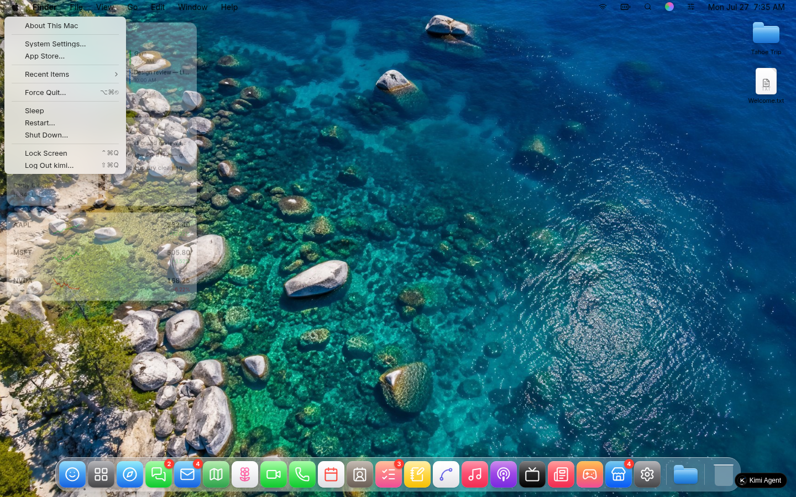
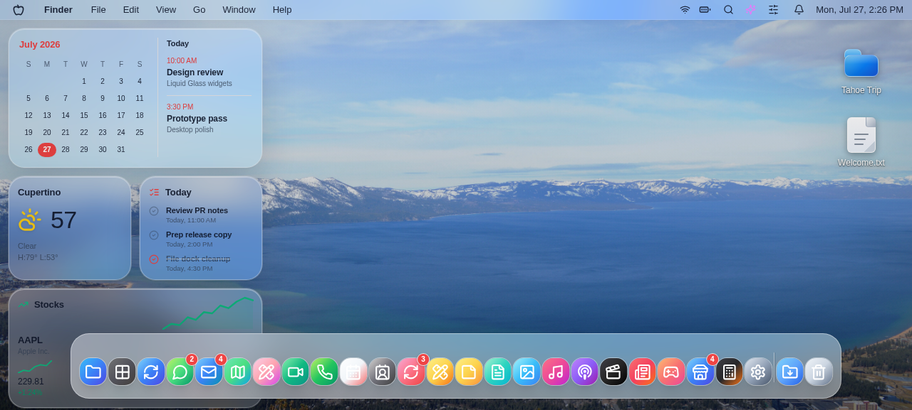
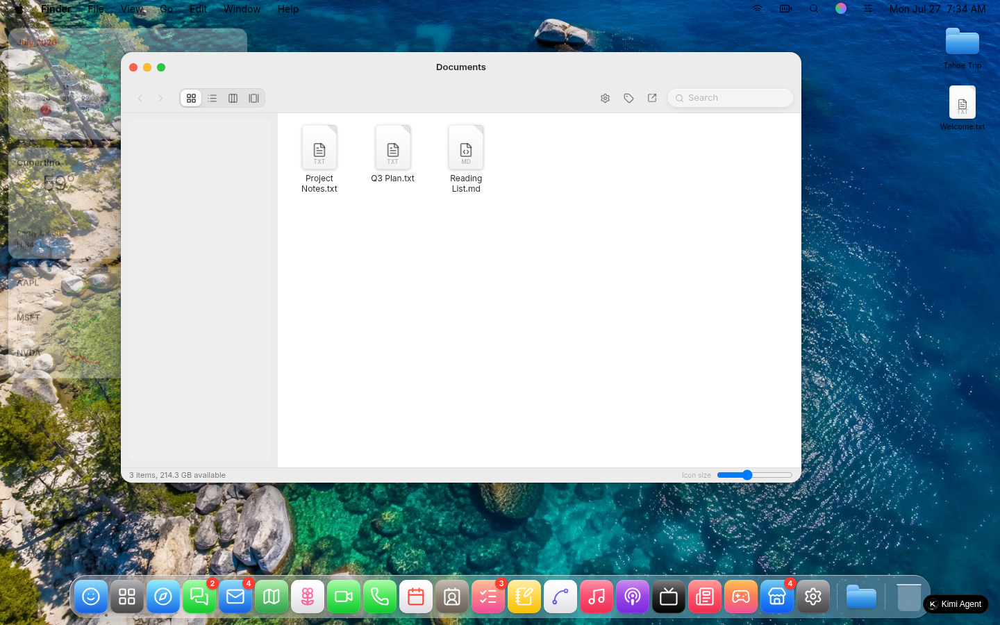
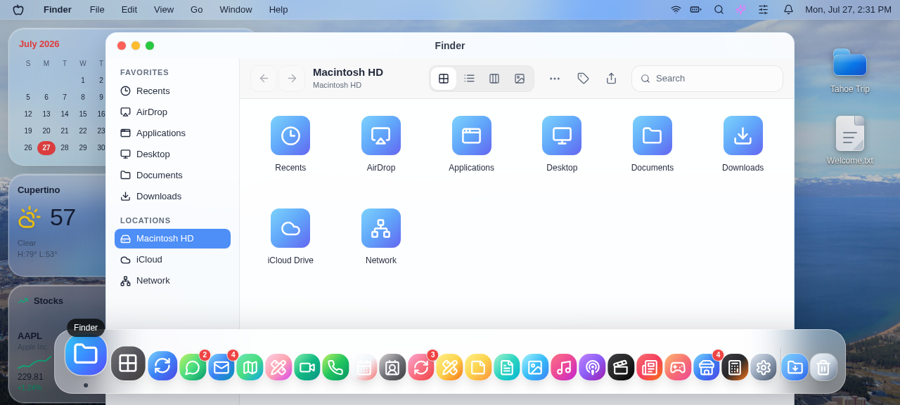
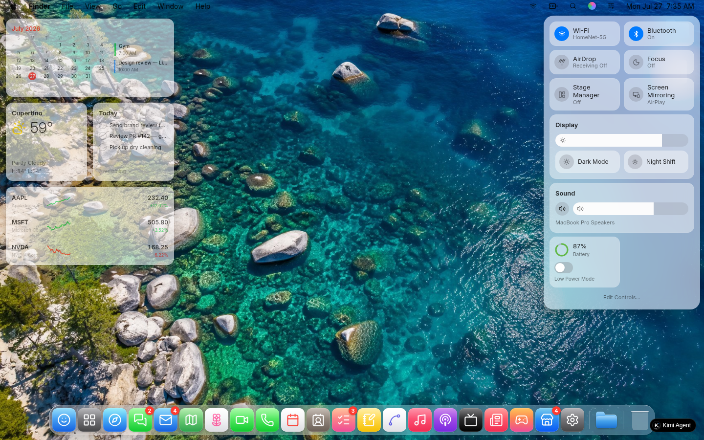
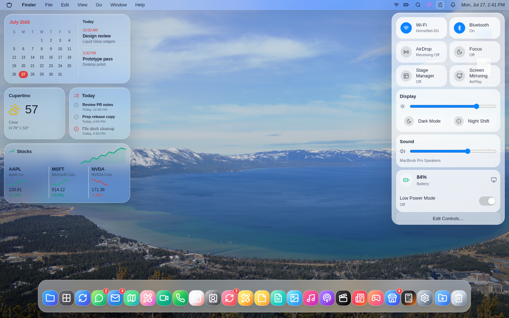
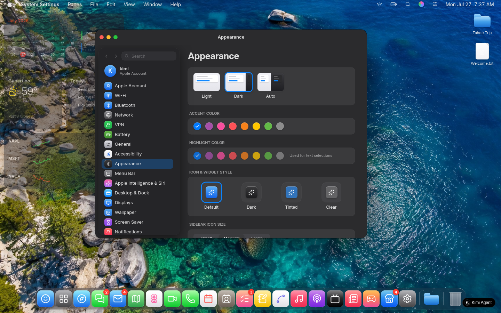
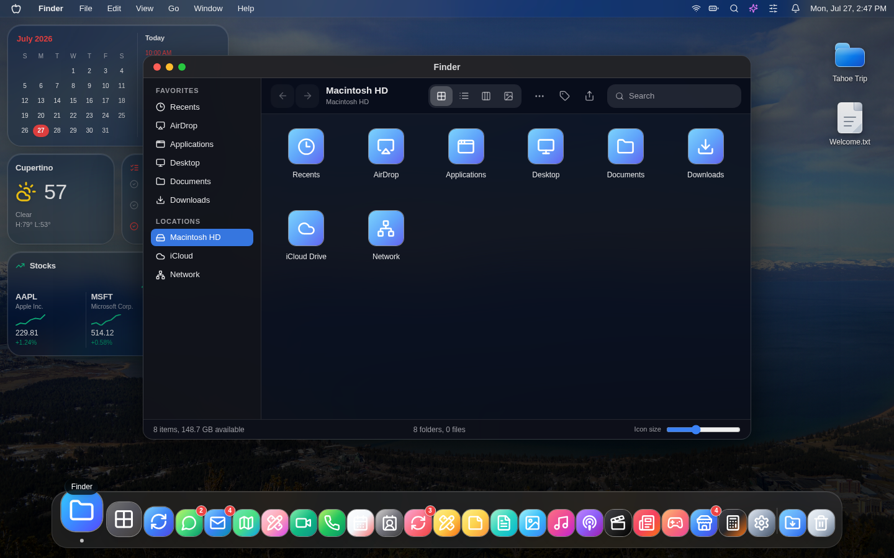
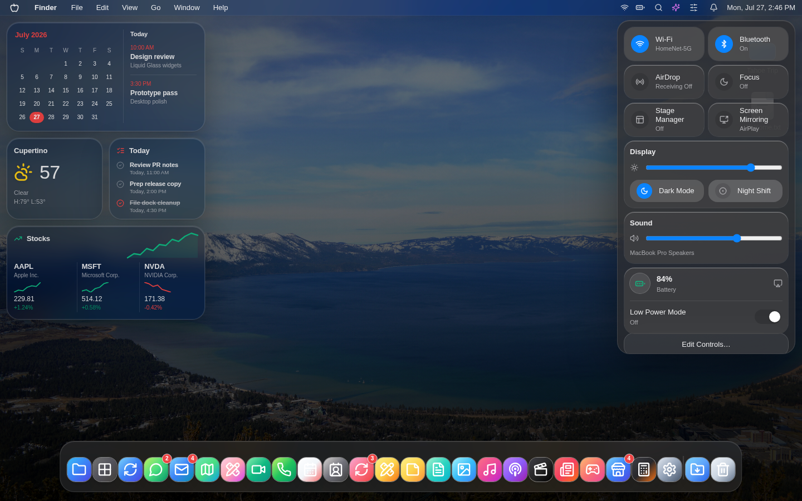

# Glass Wave3 自评

日期：2026-07-27  
验证地址：`http://10.126.126.12:5187/`  
参考站：`https://macos27.kimi.page/`，引用既有取证目录 `docs/artifacts/kimi-gap-20260727/screenshots/`。

## 实验目的

按 A→B→C→D 四张 ticket 串行打磨菜单栏、窗口 shell、Control Center 与 dark 材质层级，并对照 Kimi 参考站关键截图做视觉自评。

## 实验步骤

1. 每张 ticket 修改后执行 `npx tsc --noEmit`。
2. 使用 `agent-browser` 打开 `http://10.126.126.12:5187/`，视口设为 1440x900，按 ticket 采集截图。
3. 对照既有参考站截图做并排自评。

## 并排对比

| 场景 | 参考站 | 本轮 Wave3 | 自评 |
|---|---|---|---|
| 菜单栏 |  |  | 已补齐 Notifications，顺序为 Wi-Fi、Battery、Spotlight、Siri、Control Center、Notifications、时间；菜单栏透明度明显降低，仍比参考站略有浅色雾面。 |
| 窗口 |  |  | Finder 默认尺寸接近 980x620，圆角降到 16px，阴影更宽柔；窗口内容仍是本地 Finder 数据模型，非参考站 Documents 三文件场景。 |
| Control Center |  |  | 面板约 320x600，已补 Edit Controls… 和可切换 Low Power Mode；模块玻璃感更轻，但参考站的图标密度和局部透明折射仍更自然。 |
| Dark 整体 |  |  | 菜单栏、Dock、小组件、窗口 chrome 至少形成三档灰度层级，不再统一蓝黑；部分 App 内部仍继承 slate 深色类，和参考站完整灰度系统仍有差距。 |
| Dark 弹层 |  |  | Control Center 弹层比 Dock/小组件更实，内部模块有灰度差；暗色壁纸仍有明显蓝色环境光，未完全中性化。 |

## 验证记录

- Ticket A：`npx tsc --noEmit` 通过；证据 `a-menubar-light.png`、`a-menubar-notifications.png`、`a-menubar-dark.png`。
- Ticket B：`npx tsc --noEmit` 通过；证据 `b-window-finder-light.png`、`b-window-settings-toolbar.png`。
- Ticket C：`npx tsc --noEmit` 通过；证据 `c-cc-light.png`、`c-cc-low-power-on.png`。
- Ticket D：`npx tsc --noEmit` 通过；证据 `d-dark-control-center.png`、`d-dark-window.png`。

## 未覆盖差距

- 参考站真实内容仍更完整：Finder 默认 Documents 三文件、System Settings/Notes/Music 的完整数据和控件不属于本轮 scope。
- Dock 虽已有较多图标，但整体高度、hover 质感和参考站的密集程度仍有差距。
- 桌面小组件布局和内容已接近但不是完全复刻，玻璃折射仍偏本地实现。
- Dark 模式仍受部分 App 内部 Tailwind 暗色类影响，窗口内容区域有轻微蓝黑倾向；本轮仅按 scope 调整全局材质层级。
